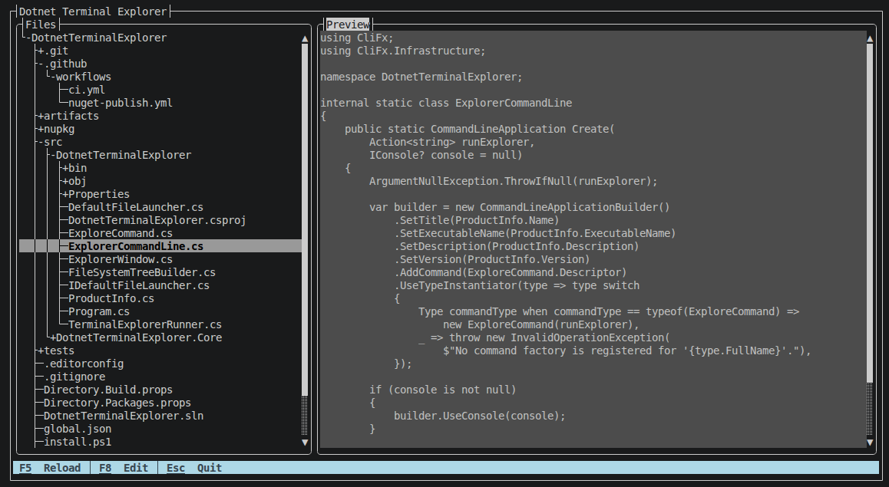
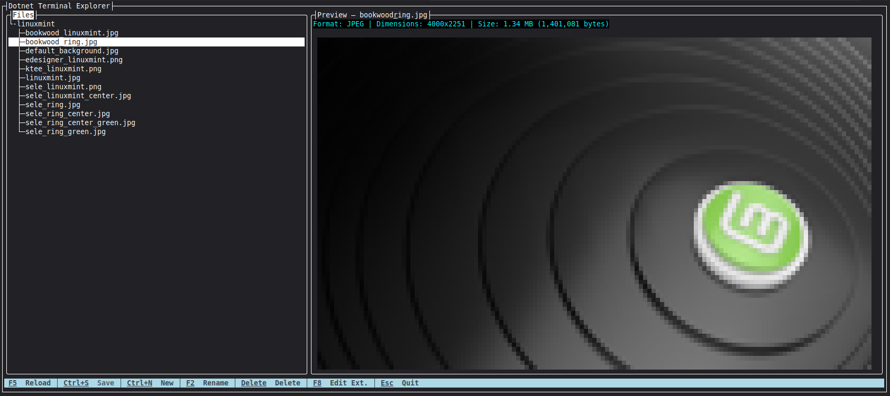

# Dotnet Terminal Explorer

Dotnet Terminal Explorer (`dte`) is a deliberately lightweight, scoped file explorer for the terminal. It opens a filesystem tree on the left and an interactive file preview and editor on the right with support for text files and TrueColor image rendering.





`dte` explores only the directory passed to it, similar to opening a folder with `code`. If the directory is omitted, it uses the current working directory.

## Requirements

- **Standalone Native Binary (Recommended):** **None** — zero dependencies or .NET runtime installation required (pre-compiled with Native AOT).
- **.NET Global Tool (`dotnet tool`):** Requires [.NET 10 Runtime](https://dotnet.microsoft.com/download/dotnet/10.0) or SDK.
- **Building from Source:** Requires [.NET 10 SDK](https://dotnet.microsoft.com/download/dotnet/10.0).

## Installation

### Option 1: Standalone Native Binary (Zero .NET runtime required)

#### Linux & macOS
```bash
curl -fsSL https://raw.githubusercontent.com/enisn/DotnetTerminalExplorer/main/install.sh | bash
```

#### Windows (PowerShell)
```powershell
irm https://raw.githubusercontent.com/enisn/DotnetTerminalExplorer/main/install.ps1 | iex
```

#### Manual Download
You can also download prebuilt standalone binaries directly from the [GitHub Releases](https://github.com/enisn/DotnetTerminalExplorer/releases) page (`linux-x64`, `linux-arm64`, `osx-arm64`, `win-x64`, `win-arm64`).

---

### Option 2: As a .NET Global Tool (requires .NET 10 Runtime)

```shell
dotnet tool install --global DotnetTerminalExplorer
```

---

## Uninstallation

### Standalone Native Binary

#### Linux & macOS
```bash
curl -fsSL https://raw.githubusercontent.com/enisn/DotnetTerminalExplorer/main/uninstall.sh | bash
```
*(Or simply remove `~/.local/bin/dte`)*

#### Windows (PowerShell)
```powershell
irm https://raw.githubusercontent.com/enisn/DotnetTerminalExplorer/main/uninstall.ps1 | iex
```
*(Or remove the `$HOME\.dte` folder)*

### .NET Global Tool
```shell
dotnet tool uninstall --global DotnetTerminalExplorer
```

---

## Usage

Run it for the current directory or a specific scoped folder:

```shell
dte
dte ./src
dte /path/to/project
```

Use `dte --help` or `dte --version` without initializing Terminal.Gui or filesystem services.

## Shortcuts

| Shortcut | Action |
| --- | --- |
| `F1` | Show the Keyboard Shortcuts & Help dialog |
| `Alt+Left` / `Alt+[` | Shrink the left Files panel width |
| `Alt+Right` / `Alt+]` | Expand the left Files panel width |
| `F5` | Reload the selected file |
| `Ctrl+S` | Save changes to the active file |
| `Ctrl+L` | Load a large file that was skipped automatically |
| `Ctrl+N` | Create a new file in the selected directory |
| `F2` | Rename the selected file or directory inline |
| `Del` | Delete the selected file or directory (asks for confirmation) |
| `F8` | Open the selected file with the operating system's default application |
| `Esc` | Quit (or cancel inline input / dialog) |

`F8` and `Ctrl+S` are disabled for directories. Files can be edited directly in the right-hand editor pane and saved with `Ctrl+S`. Press `Ctrl+N` to create a new file in the current directory or `F2` to trigger an inline rename bar in the tree pane (`Enter` commits, `Esc` cancels). Press `Del` to delete the selected file or directory after confirming in a modal dialog. Press `F1` at any time to open the full help dialog.

On ultra-wide terminals, the left file panel is automatically clamped (to 24–48 columns by default) to keep the preview pane spacious. You can manually adjust the width at any time with `Alt+Left` / `Alt+Right` (or `Alt+[` / `Alt+]`).

File previews load asynchronously so navigating the tree never blocks. Files larger than 2 MB are not read automatically; the preview shows file metadata instead and `Ctrl+L` loads them on demand.

## Initial behavior

- Directories are listed before files, and hidden entries are included.
- Only the root's immediate children are enumerated at startup. Descendants are read when their directory is expanded.
- Directory symlinks and reparse points inside the selected scope are shown but are not expanded.
- Text files support inline viewing and editing with dirty state tracking and `Ctrl+S` saving.
- Image files (`.png`, `.jpg`, `.jpeg`, `.webp`, `.gif`, `.bmp`, `.ico`, etc.) are rendered inline as TrueColor half-block (`▀`) thumbnails with format, dimension, and size metadata.
- Non-image binary files display structured metadata summaries instead of unprintable characters.
- Press `F8` on any selected file to open it with the operating system's default viewer or editor.

## Lightweight startup

The startup path intentionally avoids Generic Host and dependency injection containers. Only one source-generated CliFx command descriptor is registered, command activation uses an explicit type switch, and the command constructor stores only a runner delegate. Path validation completes before filesystem services and Terminal.Gui are created.

## Projects

- `src/DotnetTerminalExplorer.Core` — UI-independent explorer logic.
- `src/DotnetTerminalExplorer` — the packable Terminal.Gui application.
- `tests/DotnetTerminalExplorer.Core.Tests` — Core unit tests.
- `tests/DotnetTerminalExplorer.Tests` — CLI and TUI tests.

## Build

```shell
dotnet restore
dotnet build DotnetTerminalExplorer.sln --no-restore -c Release
dotnet test DotnetTerminalExplorer.sln --no-build --no-restore -c Release
```

## Pack and install for development

Create the tool and symbol packages under `nupkg`:

```powershell
pwsh ./pack.ps1
```

Repack and install the local package globally:

```powershell
pwsh ./install-dev.ps1
```

The development install script removes an existing global development installation first so rebuilding the same version is deterministic.

## Publishing

CI restores, builds, tests, packs, installs the tool into an isolated directory, and exercises `dte --help` and `dte --version`. NuGet.org publishing is a separate manual GitHub Actions workflow that requires the `NUGET_API_KEY` repository secret.

## License

MIT
